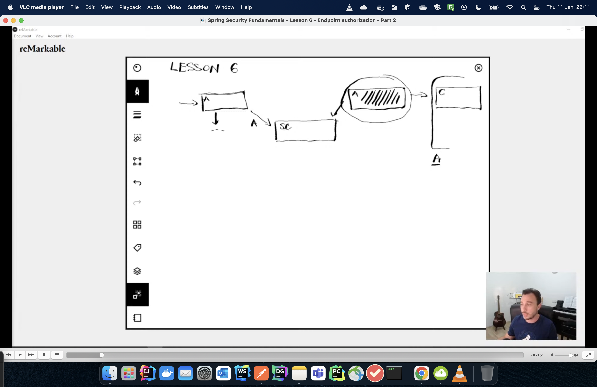

**Flow Diagram**



**Authorization Matchers**

```agsl
There are of three types:

(a)mvcMatchers (Use the path/ant matching patterns but are more secure)
(b)antMatchers (Uses the path/ant matching patterns but are less secure)
(c)regexMatchers (i am able to apply an authorization rule based on regex in the path)
   if i have a path that cannot be identiifed by ant pattern then i have regex at my disposal
```
```
Scurity context, stores an authentication instance.

The authriziation filter finds details about the authenticated user from the 
security context, and applies the authorizaton rules,

Only when the authorization rules are satisfied is the request forwarded to the
controllers.


```
```agsl

There are of three types:

1.MvcMatchers (Are more secure)

2.AntMatchers. (Are good but when not properly configured,vulnerable)

3.RegexMatchers.

```

**Implementation**

```agsl
(a)For us to apply an authorization rule on a given rest path,
we need to specify the method and the path .

(b)Rather than having multiple endpoints in the path mather is is useful
to group related paths via a prefix,

.requestMatchers("mvcMatchers","/test1","/test3").authenticated()

you can therefore add the authoties to the prefix, versioning, that will
take effect in all the related paths.

(/demo/**)-->Will apply to all endpounts starting with demo

(/demo/anything/*/test) -->will apply with only one endpoint starting with demo and
anything but ending with test.
 
```


**N/B**

```agsl
//antMatchers are a security vulnerability hence not recommended (They pose a threat if you are not specific
If we use ant matchers with an alias and say dont protect,all the endpoints will not be protected.
//MVC Matchers should be used instead
```